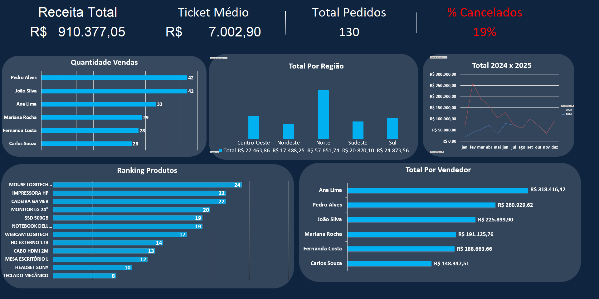

# Dashboard de Vendas 2024-2025

Projeto de análise de vendas desenvolvido durante o curso de Excel Avançado.

## Sobre o Projeto
Base de dados fictícia com 200 registros de vendas analisada do zero até a criação de um dashboard simples, cobrindo desde limpeza de dados até visualização intuitiva.

## Técnicas Utilizadas
- Formatação Condicional por status de pedido na base de dados
- Tabelas Dinâmicas com um Slicer interativo
- Fórmulas usadas: PROCV, SOMASES, SE e CONT.SES
- Consulta por ID de pedido e por Vendedor
- Dashboard com KPIs: Receita Total, Ticket Médio, Total de Pedidos e % Cancelamentos
- Gráficos de barras, linhas e colunas

## Dashboard

## Estrutura do Projeto
- `Base de Dados` — dados brutos com 200 registros e formatação condicional
- `Tabelas Dinâmicas` — análises por Região, Categoria e Vendedor com slicer
- `Consultas` — fórmulas avançadas e gráficos
- `Dashboard` — painel intuitivo para visualização objetiva

## Como Abrir
Baixe o arquivo .xlsx e abra no Excel 2016 ou superior.
